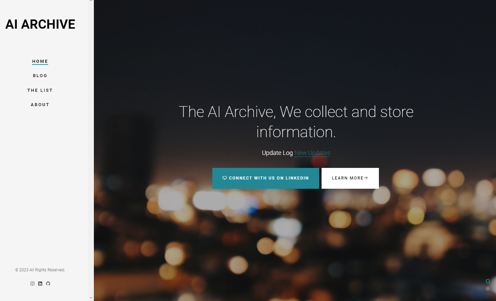
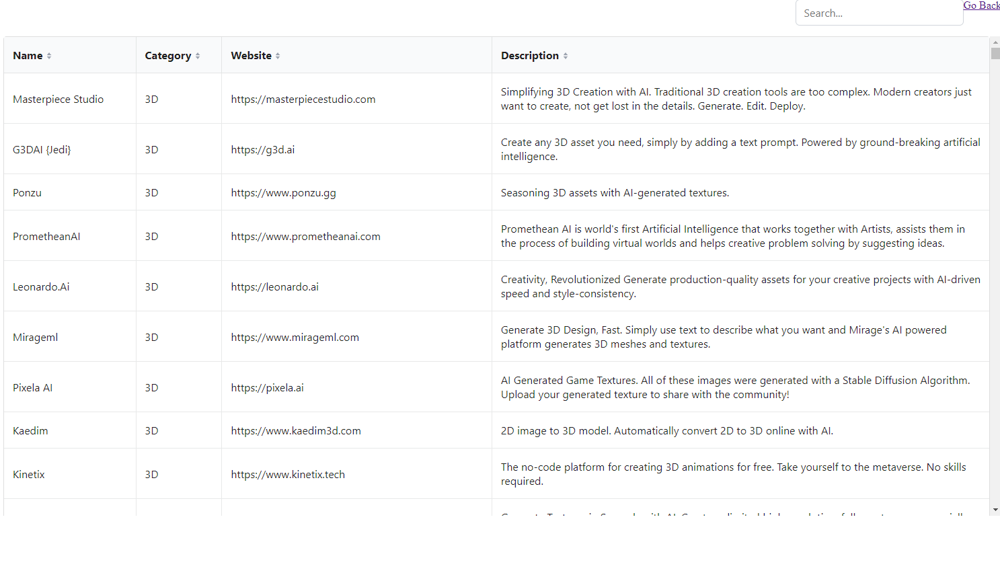
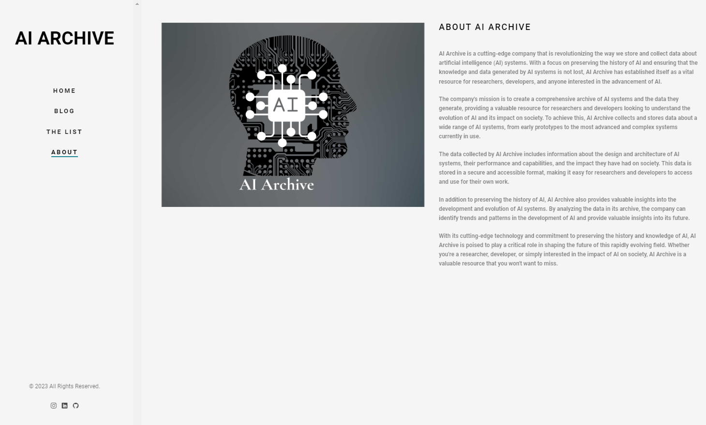

AI Archive is a website focused on preserving the history and knowledge of artificial intelligence (AI) systems. It offers a comprehensive archive of AI systems,

including information about their design, performance, and impact on society. The data is stored in a secure and accessible format for easy access by researchers and 

developers. The website also provides valuable insights into the evolution of AI and its future by analyzing the data in its archive. Whether you are a researcher, 

developer, or interested in the impact of AI on society, AI Archive is a valuable resource.

Link : https://orelmizrahii.github.io/Web-AI-Archive/

Home Page

Blog Page

The List Page

About Page

